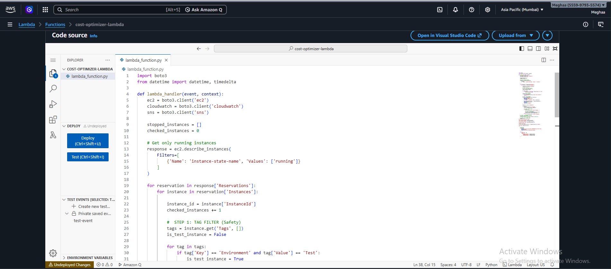
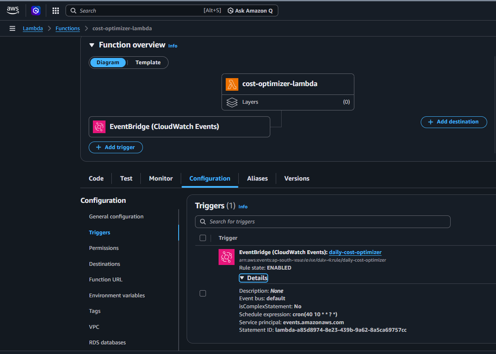
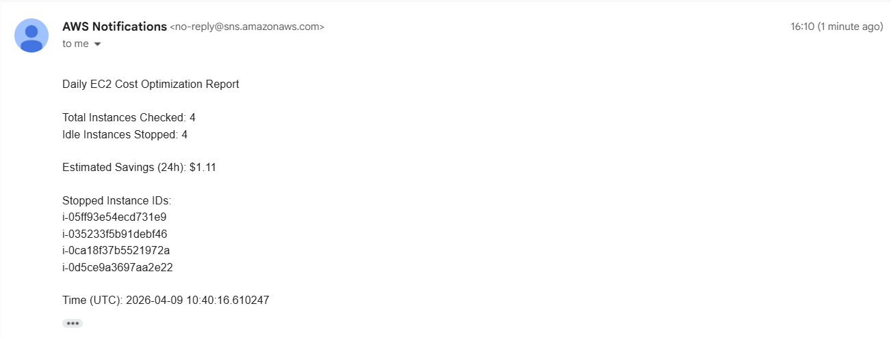
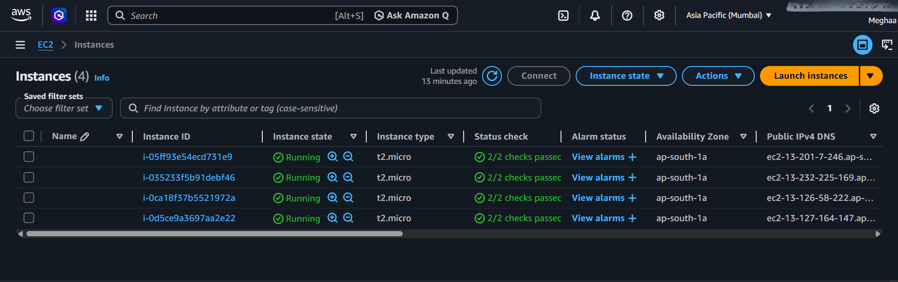
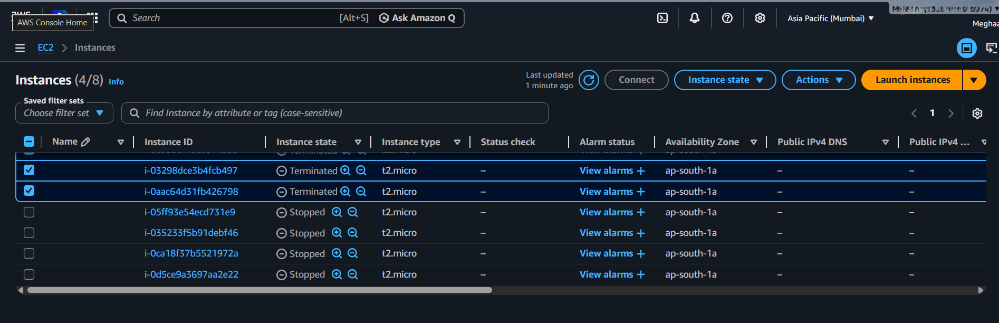
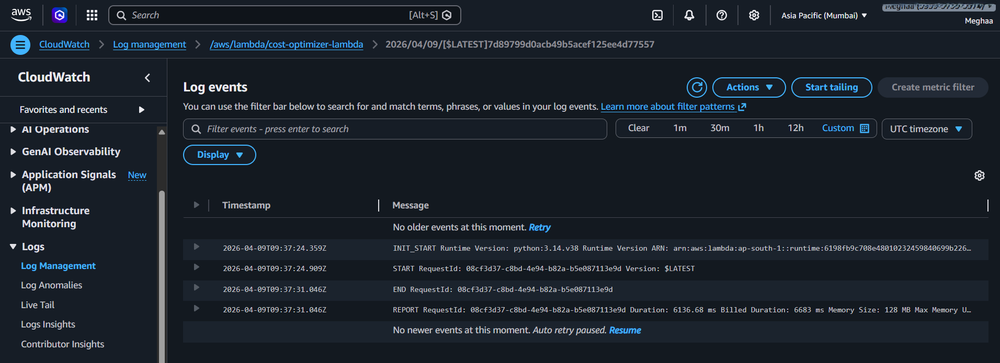

#  AWS Cost Optimization System (Serverless DevOps Project)

##  Overview

This project implements an automated AWS cost optimization system using serverless architecture. It monitors EC2 instances, detects idle resources based on CPU utilization, and automatically stops them to reduce unnecessary cloud costs.

---

##  Architecture

EventBridge → Lambda → CloudWatch → EC2 → SNS → Email

---

##  Features

*  Monitor running EC2 instances
*  Detect idle instances (CPU < 5%)
*  Automatically stop unused instances
*  Tag-based filtering (Environment = Test)
*  Daily summary email alerts
*  Estimated cost savings calculation

---

##  AWS Services Used

* AWS Lambda
* Amazon EC2
* Amazon CloudWatch
* Amazon SNS
* Amazon EventBridge
* IAM

---

##  Workflow

1. EventBridge triggers Lambda daily
2. Lambda fetches running EC2 instances
3. Filters instances using tags
4. Checks CPU utilization via CloudWatch
5. Stops idle instances
6. Sends summary email using SNS

---

##  Sample Output

Daily EC2 Cost Optimization Report

Total Instances Checked: 3
Idle Instances Stopped: 1
Estimated Savings (24h): $0.28

---

##  Screenshots

### Lambda Function

### EventBridge Trigger

### SNS Email Alert

### EC2 Before & After

### CloudWatch Logs

---

##  Use Case

Helps organizations automatically reduce AWS costs by identifying and stopping idle cloud resources.

---

##  Future Improvements

* Add dashboard (CloudWatch / Grafana)
* Extend to RDS and S3 optimization
* HTML email reports
* CI/CD integration

---

##  Author

Meghaa
